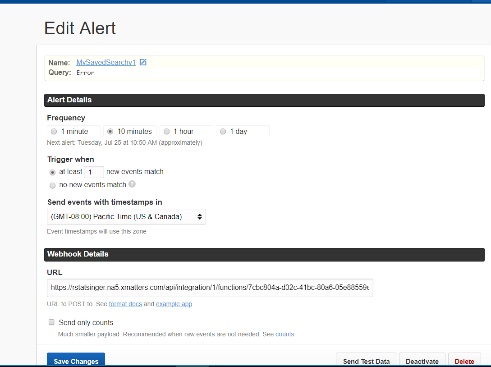

# xMatters Comm Plan for Papertrail
This xMatters Comm Plan provides a one way integration with Papertrail. It processes Papertrail events and provides xMatters notifications and response options.

# Pre-Requisites
* A Papertrail account (https://papertrailapp.com).
* xMatters account - If you don't have one, [get one](https://www.xmatters.com)!

# Files
* [Papertrailv1.zip](Papertrailv1.zip) - The comm plan (if needed) 

# How it works

This integration uses a generic Papertrail Webhook integration. When a Papertrail alert fires for a saved search, it will trigger a call into the xMatters Inbound Integration specified by this Comm Plan. The integration script then parses out the payload and builds an event and passes that to xMatters. 

# Installation
1. Configure a Saved Search in Papertrail, then an alert based off the search. Here's a screencap from Papertrail's Edit Alert screen:

<kbd>
  
</kbd>

2. Ensure that the Papertrail v1 Comm Plan has been deployed into xMatters. For help on configuring Comm Plans, please see this link:
https://help.xmatters.com/OnDemand/xmodwelcome/communicationplanbuilder/exportcommplan.htm

3. Ensure that you've set proper recipient information in the Comm Plan's PapertrailInboundWebhook form.

4. Copy the URL from the InboundPapertrailWebhook inbound integration in the Comm Plan.

5. Paste this URL into the Papertrail Edit Alert screen in the Webhook Details area (see screencap).
   
# Testing
Use the 'Send Test Data' button at the bottom of the Papertrail Edit Alert screen. You should be able to see an event in the xMatters Reports page.

